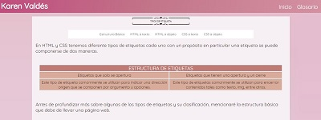

# PORTAFOLIO III PERIODO 2021

# INFORMACIÓN PERSONAL
Colegio Santa Catalina Laboure  
Karen Sophia Valdés Leonardo  
IV bachillerato en ciencias y letras con orientación en computación  
Materia: Computación (Laboratorio 1)  
Docente: Josué Fuentes  

# ÍNDICE

<ul>
  <li><a href="index.html">Homepage</a>
    <ul>
      <li>Banner
        <ul>
          <li>Boton inicio</li>
          <li>Boton glosario</li>
          <li>Frase Motivadora</li>
          <li>Boton para ir a mi perfil</li>
          <li>Boton para ir a mi readme de github</li>
        </ul>
      </li>    
    </ul>
  
  </li>
  <li><a href="glosario.html">Glosario</a>
    <ul>
      <li>Contenido
        <ul><li>Menu para rápido acceso a información
      <ul>
        <li>EStructura Básica
          <ul>
            <li>Definición</li>
            <li>Propiedades útiles para la etiqueta</li>
            <li>Ejemplos</li>
          </ul>
        </li>
      <li>Etiquetas HTML dirigidas al texto
          <ul>
            <li>Definición</li>
            <li>Propiedades útiles para la etiqueta</li>
            <li>Ejemplos</li>
          </ul>
        </li>
      <li>Etiquetas HTML dirigidas a objetos
          <ul>
            <li>Definición</li>
            <li>Propiedades útiles para la etiqueta</li>
            <li>Ejemplos</li>
          </ul>
        </li>
      <li>Propiedades css dirigidas a texto
          <ul>
            <li>Definición</li>
            <li>Propiedades útiles para la etiqueta</li>
            <li>Ejemplos</li>
          </ul>
        </li>
      <li>Propiedades dirigidas a objetos
          <ul>
            <li>Definición</li>
            <li>Propiedades útiles para la etiqueta</li>
            <li>Ejemplos</li>
          </ul>
        </li>
      </ul>
     </li>
          <li>Footer
            <ul>
              <li>Mi nombre completo y grado</li>
            </ul>
          </li>
    </ul>
      </li>
    </ul>
  </li>
</ul>

# OBJETIVOS

<ol>
  <li>Hacer que esta página web logre ser responsive al 100%, sin ningún problema.</li>
  <li>Mantener mi Glosario y Homepage de una manera organizada y legible.</li>
  <li>Hacer mi página web atractiva y llamativa para los demás usuarios.</li>
</ol>

# DOCUMENTACIÓN

Entra a este link para ver mi glosario !

https://ksvaldes.github.io/PORTAFOLIO./

